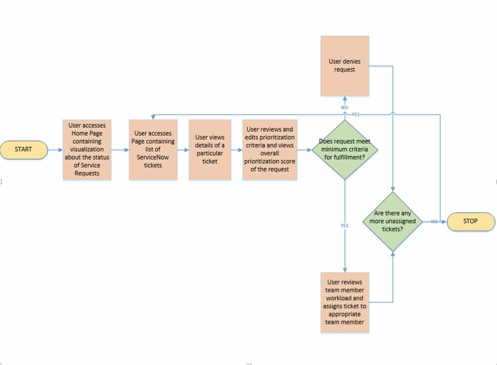

UCBEL0130DATA Group Project II
ServiceNow Data Requests Management App

Team 
Elham Saboori
Nodira Mamatova
Bilwa Buchake
Prabhakar Muriki
Jayachandran John

 
Department of Quality (DoQ)
Division of Analytics and Clinical Effectiveness (ACE)
ServiceNow Data Requests Management Application
Introduction
The Division of Analytics and Clinical Effectiveness functions to serve the needs of the Department of Quality and associated Quality & Safety initiatives. DoQ-ACE works with users to provide not just reports, but relevant and actionable analyses for and about quality improvement activities at the Organization.
Purpose
The ServiceNow Data Requests Management Application will serve as a web based portal for viewing, assigning priority and tracking all DoQ-ACE related data requests. This tool will allow the users to perform CRUD operations against the ServiceNow Data Requests dataset.

System Components and Technical Requirements
1.	Data Model - MySQL 
2.	User Interface - HTML5, CSS3, Bootstrap 3.3, Javascript
3.	Business logic/API - Flask, Python 3 
4.	Analysis Reports and Visualizations - Plotly, D3.js
